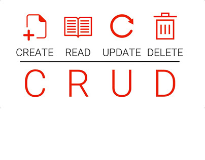

# MERN-CRUD

  

That's an advanced application, with several features that aren't common to see in other applications, like jwt authentication and password reset by an email confirmation.

---

## How to use?

First of all, clone this repo. 

After, you need to configure the project.

Make an account in a "fake SMTP server" like mailtrap (I've used this one), keep your address, port, user, and password at mind (or write in a piece of paper/note keeper, it's easier). Now, with your credentials at hand, go for src/config/mail.json file, and replace it then.

The backend can be easily launched with a single "yarn start" on the root folder.
I recommend using Insomnia or PostMan to test the routes.

---

## What this project is made for?

I've made this project with two main purposes:

The first one is to test me, joining a big slice of my knowledge, and applying then in a single project. Indeed I learned so much with this project.

The second one is to show for the people, concisely, a piece of my knowledge with these tools, creating something that we deal daily and, for most of the people, they don't have any idea how it works.

I challenge myself to create that project with the less 'overengineering' as possible. It's not a hundred percent secure and reliable but works very well for a "portfolio project".

That algorithm will be reimplemented soon on another personal project, the Inicium. Click here to know more about it.

---

# Routes

POST - /auth/register -> Register a new user;
- Receives "name", "email", and "password" on

POST - /auth/authenticate -> It's a "login", which will return an authentication token;
- Receives "name" and "password".

GET - /projects -> Return all projects registered. It's just a wadding to test properly the application. Needs to be authenticated to works;
- Needs the authorization token to works, pass it in the header section, with name "Authorization", and the token with the format "Bearer <token>" (without the quotes).

/auth/forgot -> The icing on the cake! If you have forgotten your password? This route allows you to redefine it. A token will be sent to your email (that you've used to register yourself) and you can use it to redefine your password;
- Receives the email, and the authorization token, cited before.

/auth/redefine -> You have to send your "redefine token" here, inside the JSON, accompanied by your email, and the new password. The token has an "expiration time", so, you need to be quick! (for debugging purposes, this "expiration time" is long as needed);
- Needs the email, the new password, and the token, but this time, you will pass it by JSON, not by headers section.

---

# What technologies are you using?

1. NodeJS
2. Express
3. Mongoose
4. JsonWebToken
5. BCrypyJs
6. NodeMailer

---
